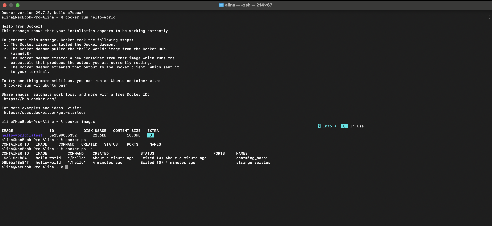
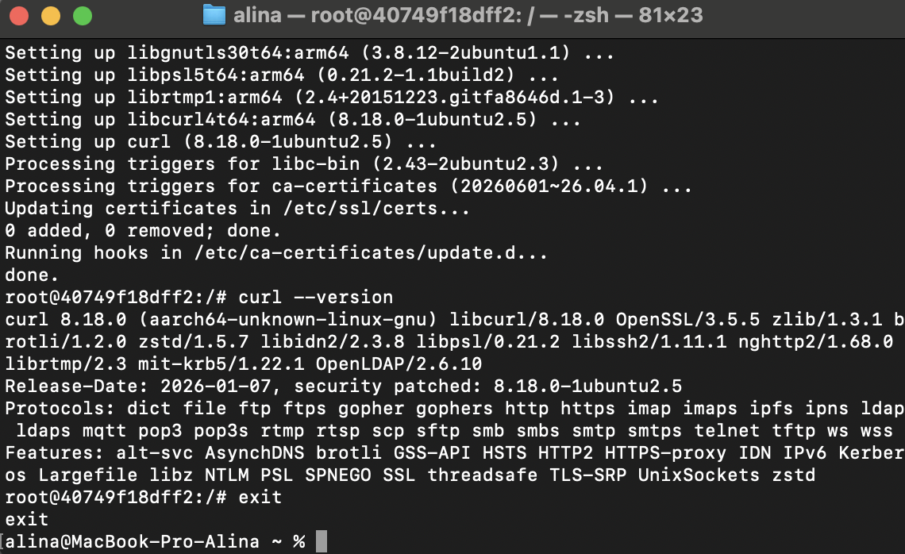
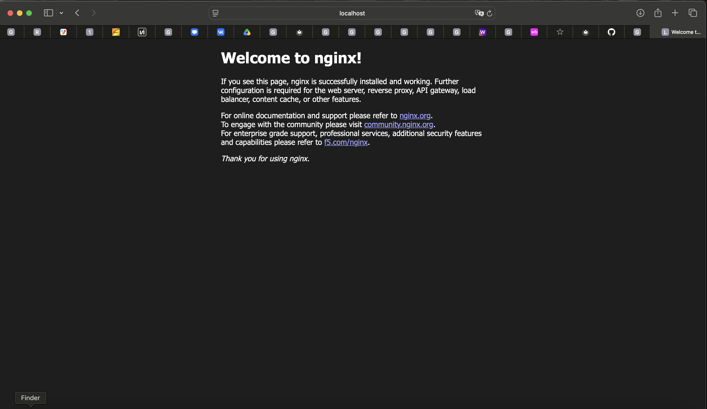
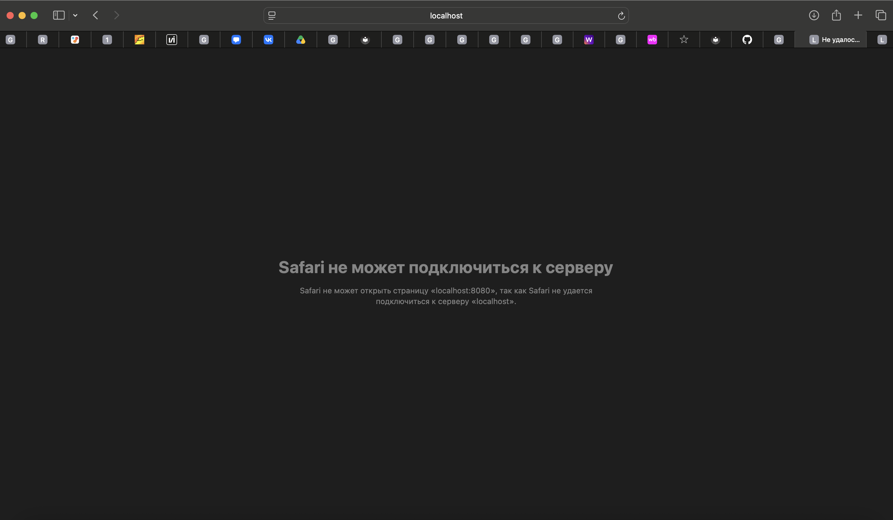
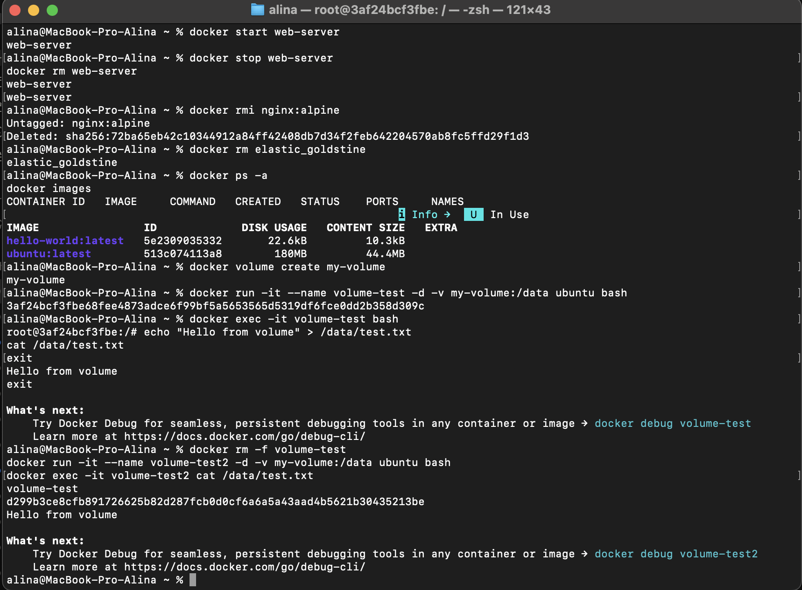

University: [ITMO University](https://itmo.ru/ru/)

Faculty: [FICT](https://fict.itmo.ru)

Course: [Введение в веб технологии](https://itmo-ict-faculty.github.io/introduction-in-web-tech/)

Year: 2025/2026

Group: U4125

Author: Пушная Алина Евгеньевна

Lab: Lab1

Date of create: 13.09.2026

Date of finished:

---

# Лабораторная работа №1. Основы работы с Docker

## Цель работы

Научиться работать с Docker: устанавливать Docker, создавать Dockerfile, собирать образы, запускать контейнеры и управлять ими.

---

## Ход работы

### 1. Установка Docker

Установлен Docker Desktop для macOS. Проверка версии:

```bash
docker --version
```

Результат:
```
Docker version 29.7.2, build a7dcaa6
```

Запуск тестового контейнера:

```bash
docker run hello-world
```

Docker не нашел образ hello-world локально, скачал его с Docker Hub и запустил контейнер, который вывел приветственное сообщение и завершился.

Изучены базовые команды:

```bash
docker images   # список скачанных образов
docker ps       # список работающих контейнеров
docker ps -a    # список всех контейнеров, включая остановленные
```



### 2. Работа с готовыми образами

Скачан образ Ubuntu:

```bash
docker pull ubuntu:latest
```

Повторный запуск команды прошел успешно: `Status: Downloaded newer image for ubuntu:latest`.

Запущен интерактивный контейнер:

```bash
docker run -it ubuntu bash
```

После запуска приглашение сменилось на `root@<id>:/#` — это означает работу внутри отдельной, чистой Ubuntu.

Внутри контейнера установлен пакет и проверена версия:

```bash
apt update && apt install -y curl
curl --version
```

Результат: `curl 8.18.0 (aarch64-unknown-linux-gnu) ...`

Выход из контейнера:

```bash
exit
```



### 3. Запуск веб-сервера

Запущен контейнер с nginx в фоновом режиме:

```bash
docker run -d -p 8080:80 --name web-server nginx:alpine
```

Проверка работы в браузере: `http://localhost:8080` — открылась стандартная страница «Welcome to nginx!».



Просмотр логов контейнера:

```bash
docker logs web-server
```

Подключение к работающему контейнеру:

```bash
docker exec -it web-server sh
```

Выход командой `exit` не останавливает контейнер — nginx продолжает работать в фоне.

### 4. Управление контейнерами

Просмотр запущенных и всех контейнеров:

```bash
docker ps
docker ps -a
```

Остановка контейнера:

```bash
docker stop web-server
```

После остановки `docker ps` перестает показывать контейнер, а в `docker ps -a` его статус меняется на `Exited`. Обновление страницы `http://localhost:8080` в браузере при остановленном контейнере вернуло ошибку «Safari не может подключиться к серверу».



Повторный запуск того же контейнера:

```bash
docker start web-server
```

Docker сохраняет настройки, заданные при создании контейнера, поэтому страница снова открылась по тому же адресу.

Полное удаление контейнера и образа:

```bash
docker stop web-server
docker rm web-server
docker rmi nginx:alpine
```

Также удален контейнер `elastic_goldstine`, оставшийся от работы с Ubuntu в пункте 2:

```bash
docker rm elastic_goldstine
```

Итоговая проверка:

```bash
docker ps -a
docker images
```

Список контейнеров пуст, из образов остались только `hello-world` и `ubuntu`.

### 5. Работа с томами (volumes)

Том нужен, чтобы данные переживали удаление контейнера — все, что создается внутри контейнера напрямую, пропадает вместе с ним.

Создание тома:

```bash
docker volume create my-volume
```

Запуск контейнера с подключенным томом:

```bash
docker run -it --name volume-test -d -v my-volume:/data ubuntu bash
```

`-v my-volume:/data` подключает том `my-volume` внутрь контейнера по пути `/data`.

Создание файла в томе:

```bash
docker exec -it volume-test bash
echo "Hello from volume" > /data/test.txt
cat /data/test.txt
exit
```

Удаление контейнера и создание нового с тем же томом:

```bash
docker rm -f volume-test
docker run -it --name volume-test2 -d -v my-volume:/data ubuntu bash
docker exec -it volume-test2 cat /data/test.txt
```

Результат — `Hello from volume` выводится и во втором, полностью новом контейнере.



---

## Возникшие трудности и их решение

Нестабильность сети при скачивании образов. Дважды (для ubuntu и для nginx:alpine) docker pull обрывался с ошибкой DNS-резолвинга при обращении к серверу, с которого раздаются образы. Помог обычный повторный запуск команды.

---

## Вывод

В ходе работы выполнена обычная часть лабораторной: установлен и проверен Docker, отработана разница между образом (шаблоном) и контейнером (запущенным из него процессом), пройден полный цикл управления контейнером — запуск, просмотр логов, вход внутрь, остановка, повторный запуск, удаление.
