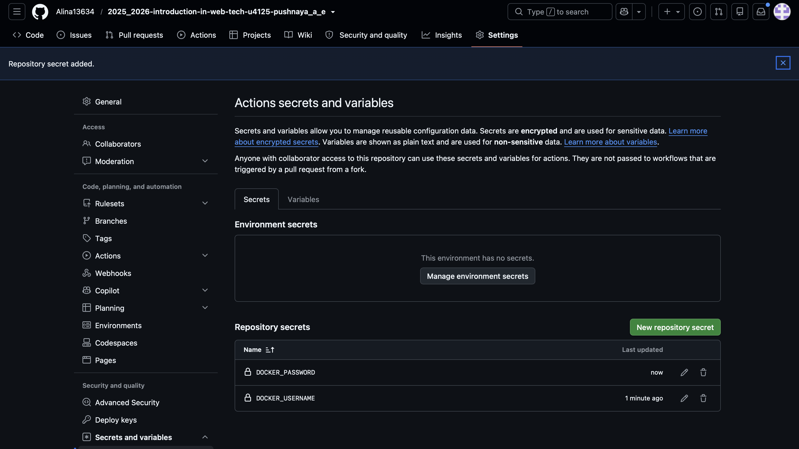
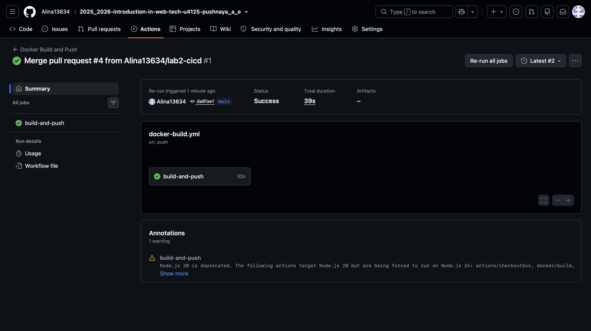
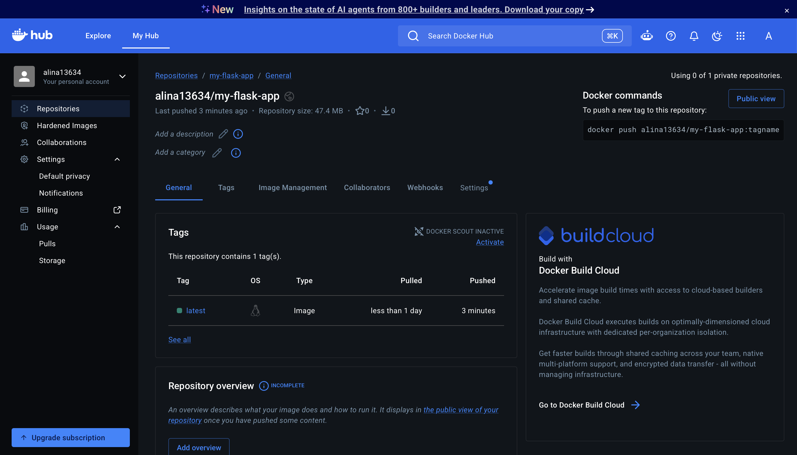

University: [ITMO University](https://itmo.ru/ru/)

Faculty: [FICT](https://fict.itmo.ru)

Course: [Введение в веб технологии](https://itmo-ict-faculty.github.io/introduction-in-web-tech/)

Year: 2025/2026

Group: U4125

Author: Пушная Алина Евгеньевна

Lab: Lab2

Date of create: 14.09.2026

Date of finished: 

---

# Лабораторная работа №2. CI/CD для Docker приложения

## Цель работы

Настроить автоматическую сборку и публикацию Docker-образа Flask-приложения в Docker Hub с помощью GitHub Actions.

---

## Ход работы

### 1. Подготовка Docker Hub

Создан аккаунт на Docker Hub (alina13634), публичный репозиторий `my-flask-app`. Создан Personal Access Token — он используется вместо настоящего пароля аккаунта для входа из GitHub Actions.

### 2. Файлы приложения

Созданы файлы в папке `lab2`:

`app.py`:
```python
from flask import Flask

app = Flask(__name__)

@app.route('/')
def hello():
    return 'Hello from Docker!'

if __name__ == '__main__':
    app.run(host='0.0.0.0', port=5000)
```

`requirements.txt`:
flask==3.0.0

`Dockerfile`:
```dockerfile
FROM python:3.9-slim

WORKDIR /app

COPY requirements.txt .
RUN pip install -r requirements.txt

COPY app.py .

EXPOSE 5000

CMD ["python", "app.py"]
```

### 3. Настройка GitHub Actions

Создан файл `.github/workflows/docker-build.yml`, запускающийся при пуше в ветку `main`. Пайплайн скачивает код, логинится в Docker Hub, собирает образ из папки `lab2` и публикует его под тегом `alina13634/my-flask-app:latest`.

### 4. Настройка секретов

В настройках репозитория добавлены два секрета: `DOCKER_USERNAME` и `DOCKER_PASSWORD`.



### 5. Проверка пайплайна

Первый запуск пайплайна завершился ошибкой — секреты на тот момент ещё не были добавлены. После добавления секретов запуск был повторен вручную и сборка прошла успешно.



На Docker Hub появился собранный образ с тегом `latest`.



---

## Вывод

В ходе работы настроен CI/CD-пайплайн: при пуше в ветку main GitHub Actions автоматически собирает Docker-образ Flask-приложения и публикует его в Docker Hub. Пройден полный цикл: подготовка файлов приложения, написание workflow-файла, настройка секретов и проверка успешной сборки и публикации образа
