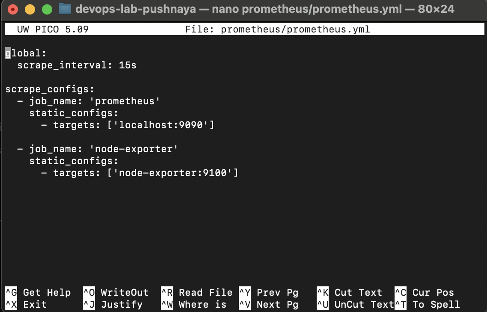
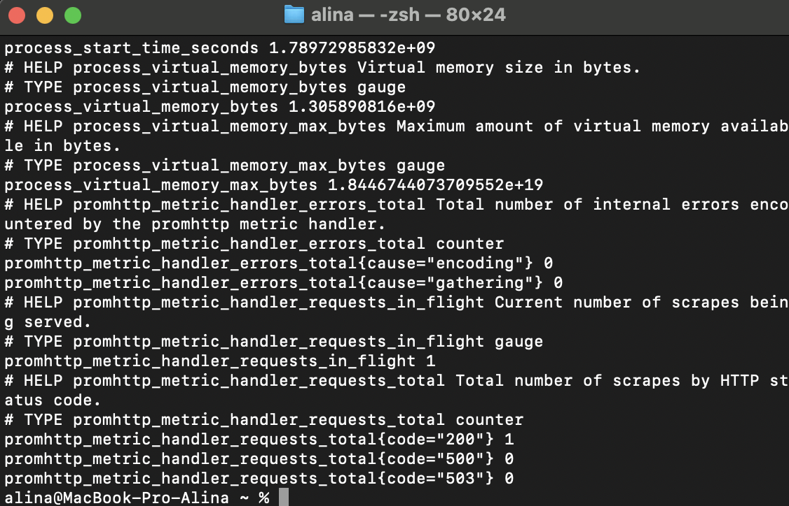
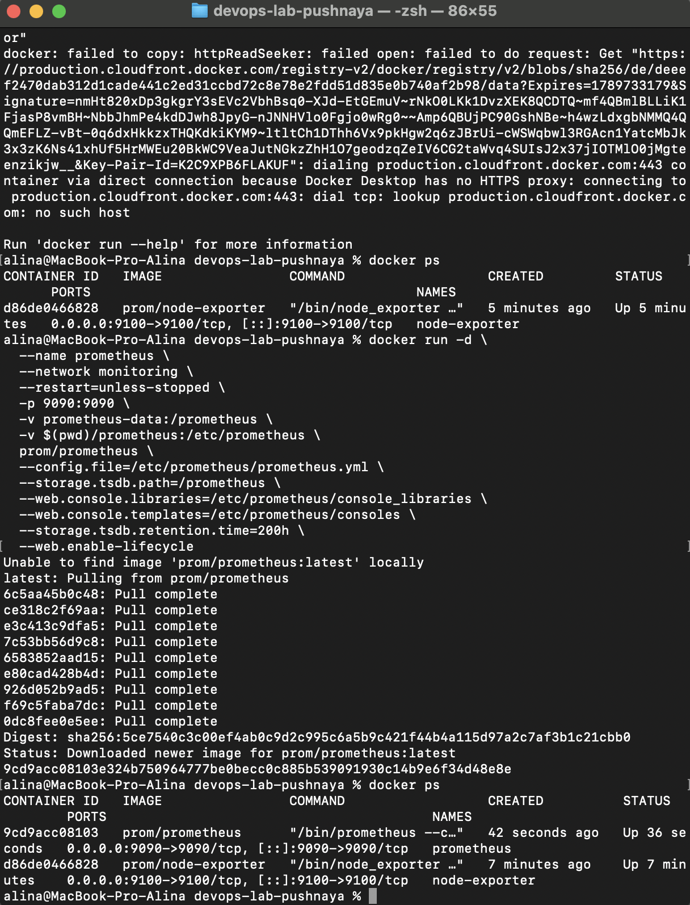
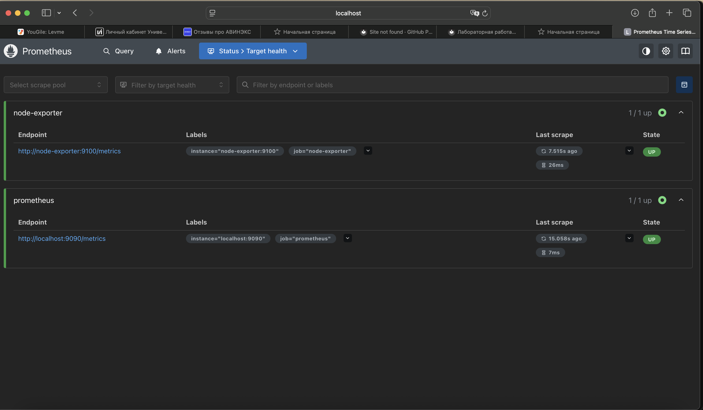
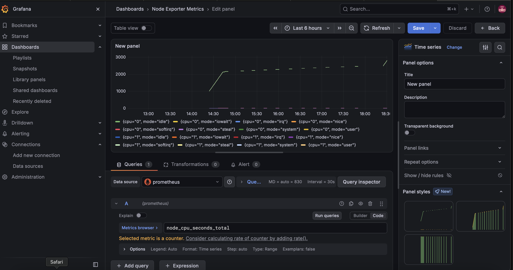
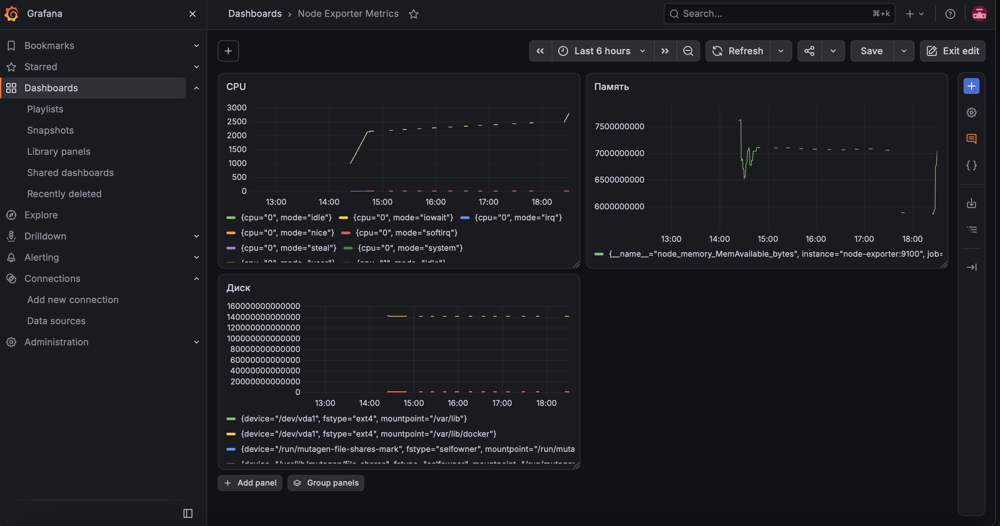

University: [ITMO University](https://itmo.ru/ru/)

Faculty: [FICT](https://fict.itmo.ru)

Course: [Введение в веб технологии](https://itmo-ict-faculty.github.io/introduction-in-web-tech/)

Year: 2025/2026

Group: U4125

Author: Пушная Алина Евгеньевна

Lab: Lab3

Date of create: 18.09.2026

Date of finished: 

---

# Лабораторная работа №3. Мониторинг с Prometheus и Grafana

## Цель работы

Настроить локальную систему мониторинга: собирать метрики с помощью Prometheus и визуализировать их в Grafana.

---

## Ход работы

### 1. Конфигурация Prometheus

Создана папка `prometheus` и файл `prometheus/prometheus.yml` с настройкой сбора метрик: интервал опроса 15 секунд, два источника — сам Prometheus (localhost:9090) и Node Exporter (node-exporter:9100).

### 2. Запуск Node Exporter

Запущен контейнер Node Exporter для сбора системных метрик компьютера (процессор, память, диск). Проверка через `curl http://localhost:9100/metrics` вернула список метрик.

### 3. Запуск Prometheus

Созданы том `prometheus-data` для хранения данных и сеть `monitoring` для связи контейнеров. Запущен контейнер Prometheus с подключением конфигурационного файла.

Веб-интерфейс Prometheus открылся по адресу `http://localhost:9090`. На странице Status → Targets оба источника отображаются со статусом UP.

### 4. Запуск Grafana

Создан том `grafana-data` и запущен контейнер Grafana в сети `monitoring`. После запуска работали три контейнера: node-exporter, prometheus, grafana.

### 5. Настройка Grafana

В Grafana (http://localhost:3000, admin/admin) добавлен источник данных Prometheus с адресом `http://prometheus:9090`. Создан дашборд с графиком метрики `node_cpu_seconds_total`.

### 6. Тестирование системы

Проверена работа всех контейнеров, сбор метрик в Prometheus и отображение графиков в Grafana. На дашборд добавлены графики для трех типов метрик: загрузка процессора (`node_cpu_seconds_total`), доступная память (`node_memory_MemAvailable_bytes`) и свободное место на диске (`node_filesystem_avail_bytes`).

---

## Вывод

В ходе работы настроена локальная система мониторинга: Prometheus собирает метрики о состоянии компьютера через Node Exporter, а Grafana визуализирует их в виде графиков. Создан дашборд с метриками процессора, памяти и диска.
